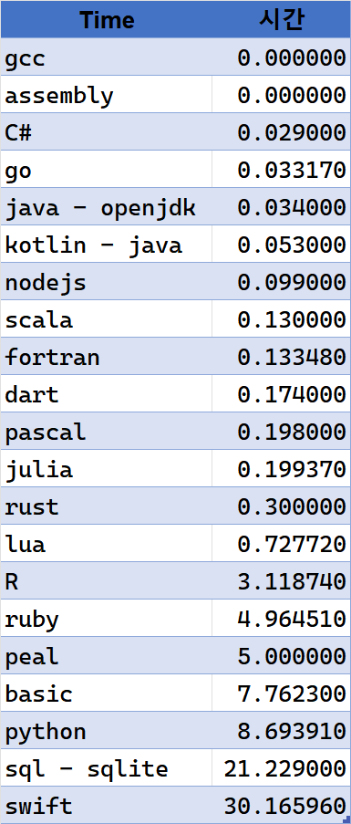

# language-benchmarking

1에서 100000000까지의 합을 구하는 프로그램을 다양한 언어로 작성하고, 각 언어별로 실행시간을 측정한다.

## 빌드 docker
``` bash
docker build -t language-benchmarking .
```

## 실행 docker
``` bash
docker run -it --name language-benchmarking --rm language-benchmarking bash
```

## docker에서 실행한 결과를 호스트로 복사
``` bash
docker cp language-benchmarking:/app/. ./result/
```

## 결과 파일 만들기
``` bash
cat result/* > result.txt
```

  

# docker run -it -v $(pwd)/kotlin:/kotlin --rm zenika/kotlin bash

docker build -t sample1 -f dockerfile1 .
docker run -it --rm sample1 bash
docker run -it -v $pwd/kotlin:/kotlin --rm sample1 bash

javac -d bin app.java && jar -cvmf manifest.txt aa.jar -C bin . && java -jar aa.jar